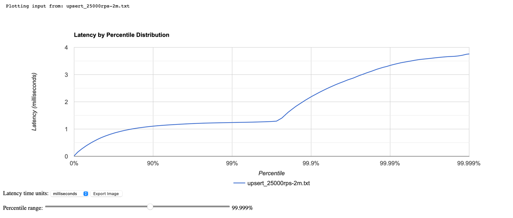
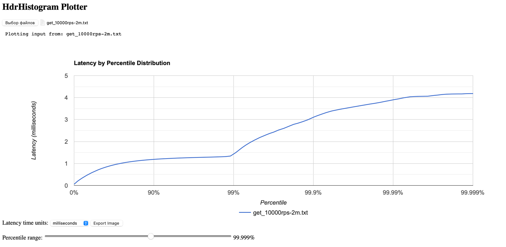
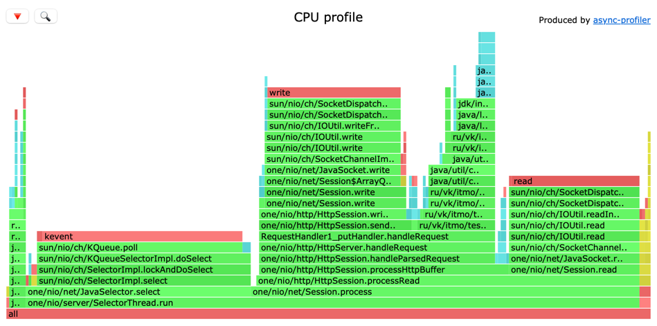

# Нагрузочное тестирование с помощью wrk2

Характеристики системы на начало тестирования при запущенном сервере


## PUT
Опытным путем была выявлена точка разладки, которая находится где-то ≈32000rps

### 33000 rps

При подаче 33000rps сервис уже не выдерживает

```
wrk -d 30 -t 1 -c 1 -R 33000 -L -s /Users/dariasupriadkina/IdeaProjects/2024-highload-dht/src/main/java/ru/vk/itmo/test/dariasupriadkina/scripts/upsert.lua http://localhost:8080
Running 30s test @ http://localhost:8080
  1 threads and 1 connections
  Thread calibration: mean lat.: 174.594ms, rate sampling interval: 611ms
  Thread Stats   Avg      Stdev     Max   +/- Stdev
    Latency   628.91ms  173.78ms 936.96ms   58.26%
    Req/Sec    32.05k   149.22    32.66k    84.38%
  Latency Distribution (HdrHistogram - Recorded Latency)
 50.000%  625.66ms
 75.000%  780.29ms
 90.000%  871.93ms
 99.000%  930.30ms
 99.900%  936.45ms
 99.990%  936.96ms
 99.999%  937.47ms
100.000%  937.47ms
```

### 32000 rps

При подаче 32000rps система справляется нормально и latency не улетает в небеса

```
wrk -d 30 -t 1 -c 1 -R 32000 -L -s /Users/dariasupriadkina/IdeaProjects/2024-highload-dht/src/main/java/ru/vk/itmo/test/dariasupriadkina/scripts/upsert.lua http://localhost:8080
Running 30s test @ http://localhost:8080
  1 threads and 1 connections
  Thread calibration: mean lat.: 4.128ms, rate sampling interval: 20ms
  Thread Stats   Avg      Stdev     Max   +/- Stdev
    Latency     3.41ms    2.69ms   9.20ms   59.40%
    Req/Sec    32.82k     1.01k   35.10k    71.57%
  Latency Distribution (HdrHistogram - Recorded Latency)
 50.000%    2.96ms
 75.000%    6.16ms
 90.000%    7.43ms
 99.000%    8.49ms
 99.900%    9.06ms
 99.990%    9.17ms
 99.999%    9.20ms
100.000%    9.21ms
```

Как видно из представленных выше результатов, при подаче 33000 запросов в секунду система начинает не справляться, о чем можно судить 
по количеству обработанных запросов и по фактической rps в 31969 запросов в секунду 

Подадим стабильную нагрузку на 20% ниже точки разладки, что равняется ≈25000 rps
и будем нагружать его в течение 30, 60 и 120 секунд
таким образом будем определять, можно ли данную величину считать за стабильную нагрузку

30s

```
wrk -d 30 -t 1 -c 1 -R 25000 -L -s /Users/dariasupriadkina/IdeaProjects/2024-highload-dht/src/main/java/ru/vk/itmo/test/dariasupriadkina/scripts/upsert.lua http://localhost:8080
Running 30s test @ http://localhost:8080
  1 threads and 1 connections
  Thread calibration: mean lat.: 0.702ms, rate sampling interval: 10ms
  Thread Stats   Avg      Stdev     Max   +/- Stdev
    Latency   633.71us  357.22us   3.93ms   60.01%
    Req/Sec    26.32k     1.78k   35.55k    64.98%
  Latency Distribution (HdrHistogram - Recorded Latency)
 50.000%  630.00us
 75.000%    0.93ms
 90.000%    1.11ms
 99.000%    1.24ms
 99.900%    2.40ms
 99.990%    3.43ms
 99.999%    3.88ms
100.000%    3.93ms

749977 requests in 30.00s, 47.92MB read
Requests/sec:  24999.51
Transfer/sec:      1.60MB
```

60s

```
wrk -d 60 -t 1 -c 1 -R 25000 -L -s /Users/dariasupriadkina/IdeaProjects/2024-highload-dht/src/main/java/ru/vk/itmo/test/dariasupriadkina/scripts/upsert.lua http://localhost:8080
Running 1m test @ http://localhost:8080
  1 threads and 1 connections
  Thread calibration: mean lat.: 0.713ms, rate sampling interval: 10ms
  Thread Stats   Avg      Stdev     Max   +/- Stdev
    Latency   632.35us  352.71us   3.70ms   59.44%
    Req/Sec    26.32k     1.76k   35.33k    65.41%
  Latency Distribution (HdrHistogram - Recorded Latency)
 50.000%  630.00us
 75.000%    0.93ms
 90.000%    1.11ms
 99.000%    1.24ms
 99.900%    2.14ms
 99.990%    3.11ms
 99.999%    3.63ms
100.000%    3.70ms

1499983 requests in 1.00m, 95.84MB read
Requests/sec:  24999.90
Transfer/sec:      1.60MB
```

120s

```
wrk -d 120 -t 1 -c 1 -R 25000 -L -s /Users/dariasupriadkina/IdeaProjects/2024-highload-dht/src/main/java/ru/vk/itmo/test/dariasupriadkina/scripts/upsert.lua http://localhost:8080
Running 2m test @ http://localhost:8080
  1 threads and 1 connections
  Thread calibration: mean lat.: 0.715ms, rate sampling interval: 10ms
  Thread Stats   Avg      Stdev     Max   +/- Stdev
    Latency   631.82us  354.65us   4.42ms   59.73%
    Req/Sec    26.30k     1.70k   35.89k    64.55%
  Latency Distribution (HdrHistogram - Recorded Latency)
 50.000%  629.00us
 75.000%    0.93ms
 90.000%    1.11ms
 99.000%    1.24ms
 99.900%    2.17ms
 99.990%    3.79ms
 99.999%    4.32ms
100.000%    4.43ms

2999962 requests in 2.00m, 191.69MB read
Requests/sec:  24999.77
Transfer/sec:      1.60MB
```

Как видно, с течением времени сервис не деградирует, значит 
25000rps можно считать стабильной нагрузкой
## GET

С помощью аналагичных действий была определена точка разладки для GET-запросов - 12000rps

```
wrk -d 30 -t 1 -c 1 -R 12000 -L -s /Users/dariasupriadkina/IdeaProjects/2024-highload-dht/src/main/java/ru/vk/itmo/test/dariasupriadkina/scripts/get.lua http://localhost:8080
Running 30s test @ http://localhost:8080
  1 threads and 1 connections
  Thread calibration: mean lat.: 109.310ms, rate sampling interval: 253ms
  Thread Stats   Avg      Stdev     Max   +/- Stdev
    Latency    34.99ms   38.29ms 107.46ms   76.02%
    Req/Sec    12.09k    93.84    12.33k    69.62%
  Latency Distribution (HdrHistogram - Recorded Latency)
 50.000%   15.57ms
 75.000%   72.25ms
 90.000%   96.45ms
 99.000%  103.10ms
 99.900%  107.01ms
 99.990%  107.45ms
 99.999%  107.52ms
100.000%  107.52ms

359990 requests in 30.00s, 39.27MB read
Requests/sec:  11999.72
Transfer/sec:      1.31MB
```

На такой rps сервер справляется с обработкой необходимого количества запросов, но latency очень велика

Возьмем значение на ≈20% меньше (≈10000rps)

И также будем нагружать 30, 60 и 120 секунд

30s

```
Running 30s test @ http://localhost:8080
  1 threads and 1 connections
  Thread calibration: mean lat.: 1.370ms, rate sampling interval: 10ms
  Thread Stats   Avg      Stdev     Max   +/- Stdev
    Latency   682.62us  348.85us   2.58ms   58.45%
    Req/Sec    10.55k     0.87k   12.22k    53.66%
  Latency Distribution (HdrHistogram - Recorded Latency)
 50.000%  681.00us
 75.000%    0.98ms
 90.000%    1.16ms
 99.000%    1.30ms
 99.900%    1.33ms
 99.990%    2.25ms
 99.999%    2.55ms
100.000%    2.58ms

299987 requests in 30.00s, 32.73MB read
Requests/sec:   9999.64
Transfer/sec:      1.09MB
```

60s

```
wrk -d 60 -t 1 -c 1 -R 10000 -L -s /Users/dariasupriadkina/IdeaProjects/2024-highload-dht/src/main/java/ru/vk/itmo/test/dariasupriadkina/scripts/get.lua http://localhost:8080
Running 1m test @ http://localhost:8080
  1 threads and 1 connections
  Thread calibration: mean lat.: 1.354ms, rate sampling interval: 10ms
  Thread Stats   Avg      Stdev     Max   +/- Stdev
    Latency   698.48us  377.87us   4.48ms   61.91%
    Req/Sec    10.56k   776.87    13.44k    67.68%
  Latency Distribution (HdrHistogram - Recorded Latency)
 50.000%  692.00us
 75.000%    1.00ms
 90.000%    1.18ms
 99.000%    1.32ms
 99.900%    2.71ms
 99.990%    4.15ms
 99.999%    4.41ms
100.000%    4.48ms

599984 requests in 1.00m, 65.47MB read
Requests/sec:   9999.78
Transfer/sec:      1.09MB
```

120s

```
wrk -d 120 -t 1 -c 1 -R 10000 -L -s /Users/dariasupriadkina/IdeaProjects/2024-highload-dht/src/main/java/ru/vk/itmo/test/dariasupriadkina/scripts/get.lua http://localhost:8080
Running 2m test @ http://localhost:8080
  1 threads and 1 connections
  Thread calibration: mean lat.: 1.442ms, rate sampling interval: 10ms
  Thread Stats   Avg      Stdev     Max   +/- Stdev
    Latency   712.35us  390.23us   4.51ms   62.98%
    Req/Sec    10.56k   795.91    15.11k    67.27%
  Latency Distribution (HdrHistogram - Recorded Latency)
 50.000%  711.00us
 75.000%    1.02ms
 90.000%    1.19ms
 99.000%    1.43ms
 99.900%    3.13ms
 99.990%    4.00ms
 99.999%    4.38ms
100.000%    4.51ms

 1199990 requests in 2.00m, 130.95MB read
Requests/sec:   9999.86
Transfer/sec:      1.09MB
```

В процессе измерений сервис не деградировал => можем считать, чито для GET-запросов стабильная нагрузка равняется 10000rps


### Результаты нагрузочного тестирования на стабильной нагрузке представлены на графиках ниже:

#### PUT



#### GET


При GET-запросах сервис выдерживает в 1.5 раза меньше запросов в секунду, чем для PUT-заппрсов с добавлением сущностей в базу данных

Причины такого поведения можно обнаружить в ходе последующего профилирования программы


# Профилирование с помощью async-profiler

### Профилирование PUT
#### CPU
[HTML-докемент](./data/upsert_25000_cpu.html)


#### Alloc
[HTML-докемент](./data/get_10000_alloc.html)


### Профолирование GET
#### CPU
[HTML-докемент](./data/get_10000_cpu.html)


#### Alloc
[HTML-докемент](./data/get_10000_alloc.html)


