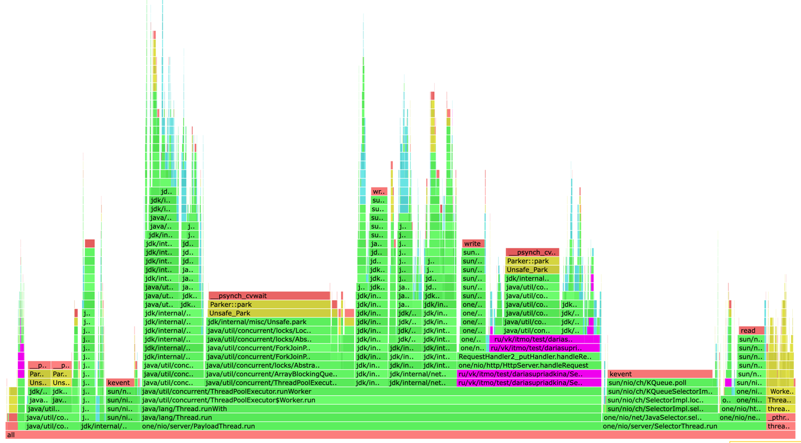
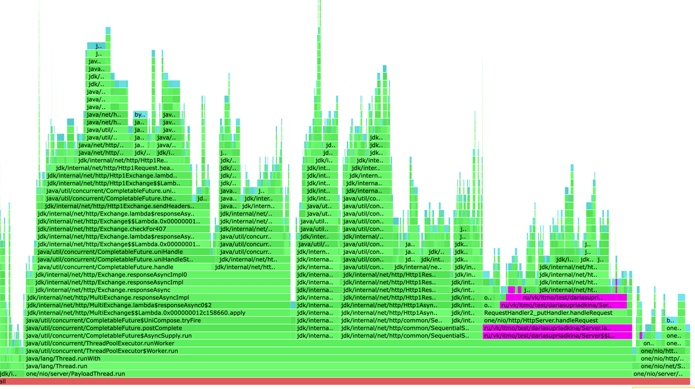
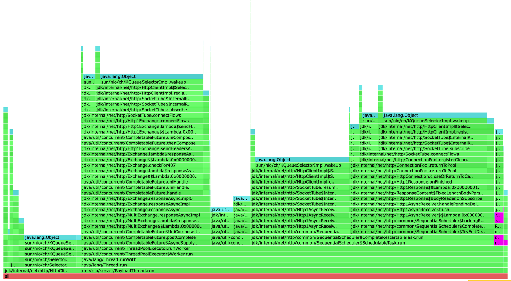
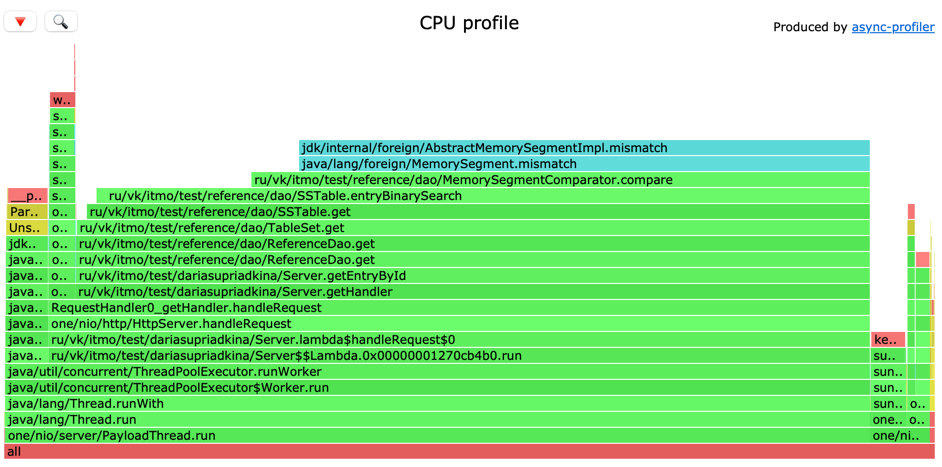

# Исследование нагрузочного тестирования и профилирования шардированного распределенного кластера

Количество ядер на машине: 8

Шардирование может производиться с целью:
1. Распределить нагрузку на разные машины - доступ к разным данным означает обращение к разным машинам (в случае, если 
шарды разнесены на разные физические узлы), что означает и использование разных дисков и т.п.  
2. Повысить надежность (в случае, если данные хранятся не на одной физической машине, отказ одного узла не приводит 
к сбою работы в остальных)
3. Увеличить скорость доступа к данным (?) - казалось бы логично, вместо того, чтобы последовательно осуществлять бин-поиск 
по всем sstable, начиная от самых новых записей, заканчивая самыми старыми. Мы будем совершать расчет значения 
hash-функции по ключу, после чего идти на конкретную ноду, где в случае обеспечения равномерного соединения, данных будет 
≈ Общее количество данных / количество нод, что может уменьшить бин-поиск в разы. Однако это утверждение езе предстоит проверить 
с помощью нагрузочного тестирования и анализа профилирования. 

В рамках данного исследования будет: 

1. Произведен сравнительный анализ сервера с предыдущего этапа (нераспределенного) и текущая реализация 
шардированного кластера с помощью нагрузочного тестирования и профилирования
2. Проанализирован код реализации шардирования и работы с сетью, возможно предложены оптимизации


## Наполнение базы данных

Во время наполнения базы данных для проведения нагрузочного тестирования на get-запросах был мгновенно обнаружен дефект.

Данные распределялись неравномерно по нодам кластера. Если быть точнее, то все данные уходили на одну единственную ноду - 
первую. 


При дальнейшем рассмотрении проблемы, было выяснено, что корень проблемы крылся в используемой функции хеширования.

Изначально в реализации использовался обычный hashCode(), а при изменении функции на murmurhash3, распределение сразу стало 
в достаточной степени равномерным:


## Нагрузочное тестирование
### PUT-запросы по рандомным ключам
Наученные предыдущим опытом, тестировать будем на одном потоке wrk в 64 конекшена

Точка разладки при таких параметрах ≈25000rps

60s
```
wrk -d 60 -t 1 -c 64 -R 25000 -L -s /Users/dariasupriadkina/IdeaProjects/2024-highload-dht/src/main/java/ru/vk/itmo/test/dariasupriadkina/scripts/upsert.lua http://localhost:8080
  Latency Distribution (HdrHistogram - Recorded Latency)
 50.000%   23.71ms
 75.000%   73.34ms
 90.000%  102.27ms
 99.000%  145.66ms
 99.900%  182.01ms
 99.990%  190.21ms
 99.999%  196.48ms
100.000%  199.42ms
```

120s
```
wrk -d 120 -t 1 -c 64 -R 25000 -L -s /Users/dariasupriadkina/IdeaProjects/2024-highload-dht/src/main/java/ru/vk/itmo/test/dariasupriadkina/scripts/upsert.lua http://localhost:8080
Latency Distribution (HdrHistogram - Recorded Latency)
 50.000%   24.16ms
 75.000%   71.55ms
 90.000%   99.26ms
 99.000%  147.84ms
 99.900%  186.24ms
 99.990%  203.65ms
 99.999%  238.59ms
100.000%  256.25ms
```
180s
```
wrk -d 180 -t 1 -c 64 -R 25000 -L -s /Users/dariasupriadkina/IdeaProjects/2024-highload-dht/src/main/java/ru/vk/itmo/test/dariasupriadkina/scripts/upsert.lua http://localhost:8080
Latency Distribution (HdrHistogram - Recorded Latency)
 50.000%   16.94ms
 75.000%   68.48ms
 90.000%   96.77ms
 99.000%  132.22ms
 99.900%  170.75ms
 99.990%  195.46ms
 99.999%  207.10ms
100.000%  215.29ms
```
При таких параметрах сервер с течением времени не деградирует,
чего нельзя сказать о нагрузке в 26000rps

120s
```
wrk -d 120 -t 1 -c 64 -R 26000 -L -s /Users/dariasupriadkina/IdeaProjects/2024-highload-dht/src/main/java/ru/vk/itmo/test/dariasupriadkina/scripts/upsert.lua http://localhost:8080
  Latency Distribution (HdrHistogram - Recorded Latency)
 50.000%  120.13ms
 75.000%  912.38ms
 90.000%    1.30s
 99.000%    1.45s
 99.900%    1.51s
 99.990%    1.55s
 99.999%    1.57s
100.000%    1.59s
```


### GET-запросы по рандомным ключам

Проведем нагрузочное тестирование на get-запросах на предварительно заполненной бд


Точка разладки: ≈33000rps

30s
```
wrk -d 30 -t 1 -c 64 -R 33000 -L -s /Users/dariasupriadkina/IdeaProjects/2024-highload-dht/src/main/java/ru/vk/itmo/test/dariasupriadkina/scripts/getrand.lua http://localhost:8080
  Latency Distribution (HdrHistogram - Recorded Latency)
 50.000%    4.38ms
 75.000%    8.67ms
 90.000%   11.61ms
 99.000%   15.96ms
 99.900%   26.09ms
 99.990%   29.26ms
 99.999%   38.49ms
100.000%   42.69ms
```

120s
```
wrk -d 120 -t 1 -c 64 -R 33000 -L -s /Users/dariasupriadkina/IdeaProjects/2024-highload-dht/src/main/java/ru/vk/itmo/test/dariasupriadkina/scripts/getrand.lua http://localhost:8080
  Latency Distribution (HdrHistogram - Recorded Latency)
 50.000%    4.25ms
 75.000%    8.65ms
 90.000%   11.57ms
 99.000%   17.26ms
 99.900%   26.98ms
 99.990%   35.30ms
 99.999%   42.91ms
100.000%   56.67ms
```

При таких параметрах, как видно в таблицах, сервер не деградирует, чего нельзя сказать о нагрузке в 34000rps

30s
```
Latency Distribution (HdrHistogram - Recorded Latency)
 50.000%    7.40ms
 75.000%   11.14ms
 90.000%   14.46ms
 99.000%   25.74ms
 99.900%   33.05ms
 99.990%   45.82ms
 99.999%   49.12ms
100.000%   50.17ms

```

120s
```
Latency Distribution (HdrHistogram - Recorded Latency)
 50.000%    8.72ms
 75.000%   15.05ms
 90.000%   87.68ms
 99.000%  150.14ms
 99.900%  198.53ms
 99.990%  217.22ms
 99.999%  223.49ms
100.000%  226.81ms
```
### Сравнение с предыдущей версией

На одинаково заполненных базах данных (одинаковое количество записей) результаты следующие:

|            | Метод      | Выдерживает rps | latency (99.99) |
|------------|------------|-----------------|-----------------|
| Сервер HW2 | PUT        | 70000rps        |195.46ms         |
| Сервер HW3 | PUT        | 25000rps        |10.29ms          |
| Сервер HW2 | GET-random | 40000rps        |8.78ms           |
| Сервер HW3 | GET-random | 33000rps        |35ms             |

Как видно из сравнительной таблицы, с точки зрения задержек и максимального rps 
в третьей лабораторной работе не удалось выйграть по сравнению со второй

Выглядит вообще так, что мы значительно во всем проиграли с точки зрения перфоманса,
причины должны будут стать понятны при проведении профилирования


## Профилирование - PUT
Первое, в чем будем разбираться - что случилось с PUT? 
Почему latency значительно увеличилось, а rps уменьшился

### CPU


Новые накладные расходы:
* Новый метод handleProxy, отвечающий за редирект запроса на другую ноду, занимает ≈12%
  (внутри этого метода методы HttpClient - sendAsync, также CompletableFuture.get и одновременно с этим видно, как мы 
  вызывваем блокировки)
* Работа HttpClient
  * SelectorManager - ≈8%
  * DelegatingExecutor (внутри которого исполняется SchadulableTask) ≈4%
  * AsyncSupply ≈8% (внутри которого responseAsync)
* ArrayBlockingQueue.take ≈20%, внутри которого у нас также вызываются блокировки ё
(с учетом работы http-клиента, блокировки на очереди у нас не только у worker-тредов, но и у executor'а самого http-клиента)

Бизнес-логика здесь занимает немного - Memtable.upsert - 0,63%, flush, запись в SSTable и
получение ноды по id (где мы применяем ConsistentHashing) также менее 1%

В самом низу мы видим, что огромная доля работы у нас приходится именно на поддержание работы тредов
Worker.run (58,35%) в нашем случае объединяет в себе 2 executor'а: worker-executor и node-executor (http-клиента)
Точнее даже больше - все 6, так как у нас в приложении 3 ноды кластера, где каждая - отдельный инстанс сервера
со своими пулами тредов

Большое количество тредов также, вероятно может влиять на производительность системы. Одномоментно на мошине может 
исполняться столько потоков, сколько в ней ядер. На моей машине их 8 => 8 потоков. Все остальное - переключение между исполняемыми потоками

### Alloc


С аллокациями дело обстоит весьма похожим образом, что и в CPU, образом

Здесь лишь меньше выражен SelectorManager, а затраты на треды-исполнители (worker-executor'ы и node-executor'ы) 
занимают почти 90%
### Lock 


89% локов уходит на работу с сетью (опять победа в ожидании получения блокировок у методов, связанных с сетью)
8% - ThreadPoolExecutor.getTask()


## Профилирование - GET-random
У Get-запросов все происходит аналогичным образом, как и у PUT, что вполне логично. Ведь все, чем они отличаются - это бизнес-логикой.
У Get-random благодаря бин-поискам она более затратна, но ничем больше они не отличаются. 

Так как в самом начале было предположение, что шардирование вполне могло бы помочь нам увеличить performance get-запросов, 
то имеет смысл поподробнее остановиться лишь на профиле CPU

### CPU


Основной метод бизнес-логики, с помощью которого мы получаем значение сущности по ключу занимае ≈10.5% (903 samples)

В прошлой лабораторной работе это занимало намного больше:


Вероятно, сам поиск сущности по ключу и оптимизировался таким образом, но из-за затрат на работу с http, общего выиграша - не получилось 

Хотя, нужно конечно отметить, что из-за получившейся оптимизации метода получения сущности, сам
performance get-запроса пострадал не так сильно, как PUT

Если нагрузка, которую сервис может держать при PUT-запросах уменьшилась в несколько раз,
то при GET-запросах всего на 17,5%

*Во всех профилях фиолетовым отмечен пользовательский код

## Выводы

С помощью шардирования мы можем:
1. Достичь большей доступности сервиса - так как, если одна из машин, на которой работает экземпляр сервера недоступна, то недоступна только часть данных,
остальные ноды это никак не затрагивает *в идеале конечно, но не в случае, когда все ноды расположены на одной машине, как в этой лабе*
2. Горизонтального масштабирования - так как мы распределяем ресурсы между несколькими машинами *в идеале конечно, но не в данной лабе*. 

Здесь мы завязаны на возможности одной конкретной машине и можем распоряжаться только ее ресурсами. 
Даже число используемых потоков у нас изменяется как _число_нод_ * _число_потоков_в_одной_ноде_.

Возможно, можно добиться некоторых оптимизаций, если попытаться поиграться количеством создаваемых worker-threads, node-threads, selector_threads...


Из скриншотов visualVM видно, что некоторые треды http-клиента вообще не получили процессорное время. То же можно сказать и про worker'ов, отвечающих за бизнес-логику.

3. Неправильно выбранная хеш-функция может сломать всю суть шардирования и в таком случае все, что мы получим - накладные расходы на сеть, если будем обращаться не к той ноде
